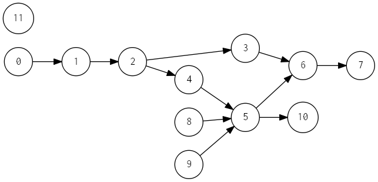
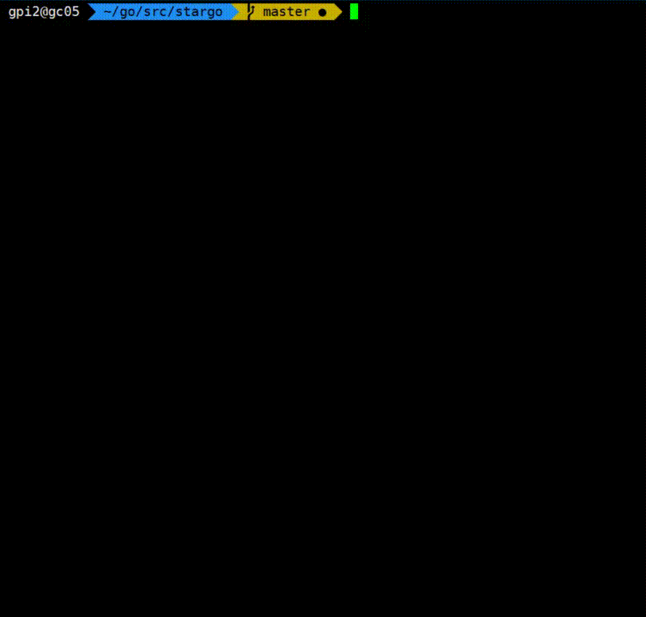

# stargo

## Introduction

stargo: STAR(Scheduling Tasks Asynchronously Runtime) implemented with Golang.

STAR is a parallel optimization engine based on DAG scheduling. 

Golang is natrually designed for parallel and distributed programming. So, we implemented STAR using Golang.

## Components

### Task

task wrapper.

### Dag

DAG composed of tasks.

### Pool

pool of goroutines.

## Usage

### example

#### demo_01

demo_01 is a simple example, whose dag is as follows:

execution and result:

